## Table of Contents
- [Table of Contents](#table-of-contents)
    - [一日目](#first-day)
    - [二日目](#second-day)
    - [三日目](#third-day)
    - [最後に](#finally)

久しぶり。この間[LoL World Championship 2025](https://www.youtube.com/watch?v=ulwJuev03qA)のために上海に行きました。イベントはたのしかったけどもっと楽しかったことは料理とタピオカティーのことです。この記事で上海で食べた物をすべて共有します。

## 一日目<a name="first-day">
### 佳家汤包 (Jia Jia Tang Bao)
金曜日22時半ぐらいに着陸しました。その夜は何も食べなかった（上海は比較的に店は閉めるに早い方とおもいます）。次の日で朝早くに起きてXLBを食べに行きました。佳家汤包は結構有名のために混んでいましたけど一人席はとれました。

上海で他人とテーブルを共有のは普通と覚えました。初めての店なので注文の仕方はわからなくて相手を聞きました。彼女は丁寧にalipayでＱＲコードをスキャンしたら注文できると教えてくれました。本当にこの知識は必要でした（中国で主にalipayかwechatpayから注文するか中国のuber eatsようなアプリmeituanで注文します）。

店でＸＬＢの三種類と何かのチリソースがかけてワンタンを注文しました。

<a name="xlb">

どっちもおいしかったです。XLBは普通・カニ・キノコ？の種類がありました。カニは一番おいしかったです。自分の好みで順番はカニXLB＞ワンタン＞普通XLB＞キノコXLB。けどすべてはおいしかったです文句なしです。

XLB: 4/5,
ワンタン: 3.75/5

### ジャンビン
佳家汤包の辺りは色んな飲食店がありました。主にストリートフードでした。その中で一つの店は朝食の料理を売りました。ジャンビンはクレープみたいなサンドウィッチです。中身は卵と漬物とネギとカリカリな物が含まれていました。追加課金をすれば肉と野菜も追加できます。この料理は７RMB（～１５０円）本当に安かったです。中国で食べ歩きはありなので近くの[上海人民公園](https://maps.app.goo.gl/YZN1n4SytyeHmN4q7)でたべました。

<a name="jianbing">

写真はちょっと悪いですけど本当にうまかったです。

ジャンビン: 4/5

### 馅饼（xian bing・シャーピン）

その後は人民広場にぶらぶらしてあるシャーピンの店の前に来ました。大きさはそんなに大きいじゃなかったですが買いました。味は普通に美味しかったけど他の食べ物のほうはよかったです。醤油がちょっと強かったです。コスパー的にはよかったです（７RMBぐらいでした）。

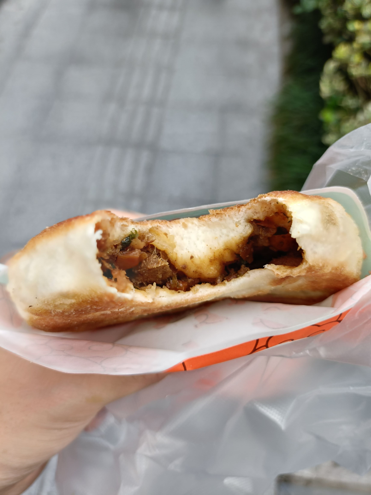

シャーピン： 3/5

### レモンティー - CHAGEE
上海に行って一つの期待したことはタピオカティーでした。前の会社の台湾出生な同僚から台湾で安いタピオカティーは買えるよと言われましたけど上海でも値段は悪くないでした。前に住んでたトロントと東京に比べて大サイズの平均の値段は12-20RMBぐらい（現在260-445円ぐらい）。東京は６５０～８００円ぐらいとトロントは$7-8CADぐらいは平均と思います。

ちなみにこれはmixueを除いての平均です。Mixueは普通のタピオカティーは8?RMBぐらい（１８０円）でした（東京店で500円ぐらい）。

値段を除いてこの茶は本当に美味しかったです。この茶でレモンティーは結構好きと気づきました。そして甘さは少なめでちょうど良かったです。特にライムはうまかったです。

レモンティー: 4/5

### 麻酱面(マージョンミェン・ma jiang mian) - 味香斋 (ウェイシャンザイ・Wei Xiang Zhai)

上の食べ物は朝で食べましたけどその後はあんまりお腹は空きませんでした。とこの日はLoLの世界大会も見ました。その試合は楽しかったです。KTはダークホース見たいなものなので本当に勝った際は信じられなかった。観察者の皆さんもイキイキでした。来週でT1に負けたはちょっと残念ですが私はT1のファンなのでつらいですね特にBDDに。

まあそれを置いておいてメルセデスベンズアリーナで食べ物は高かったために買わなかった。ちなみに上海で時々カナダのコーヒーチェーンtim hortonsを見ましたけどちょっと意外でした。中国でドーナツよりコーヒーとベーグルの方が流行ったそう。

けど色々な場所に回ったけど最後にウェイシャンザイに行きました。この店はマージョンミェン(ごま麺)にミシュランおすすめです（星ではない）。それを注文して他に豚ロースと辣引き肉も頼みました。麺は美味しかったけどちょっと厚かったです。けど引き肉はチリ油に纏ってトッピングなものは途中で気づいて際に混ぜました。混ぜて後は本当にうまかった。ゴマソースだけはちょっと厚いです。とポークロースは普通に美味しかったです。

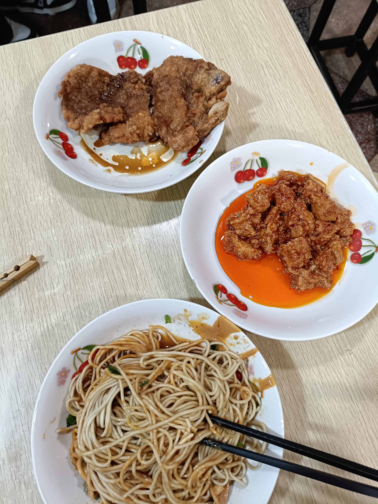

麻酱面: 3.5/5 (混ぜた状態 4/5),
ポークロース: 3.5/5,
らーひき肉（単品）: 3.3/5

### 生煎包(シェンジェンバオ・sheng jian bao)

麺の後でホテルに歩きました。その途中でショッピングモールがあってもうちょっと食べたかったなので小揚生煎(Yang's dumplings)で生煎包を注文しました。閉める時間に近かったために普通のシェンジェンバオしかありませんでしたですが美味しかったです。けど中のスープは一つの包から爆発しました。普通の食べ方は皮を小口で食べて中のスープを吸ってから食べるけど最初は大口を試した結果は全滅でした。けど美味しいです。この記事を書いている時は三週間後ですがすべての食べ物は恋しいです。

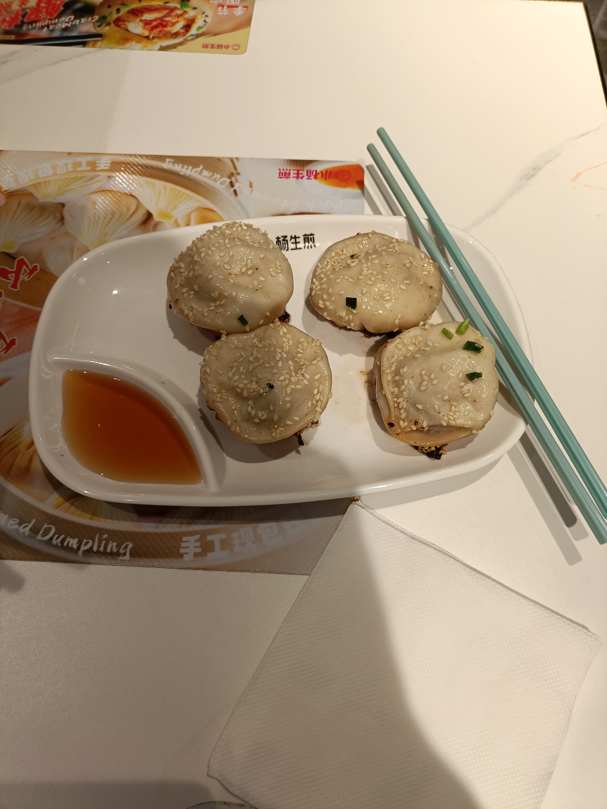

### チョコアイスバー

一日目に最後に食べてものはセブンから買ったアイスです。普通に美味しかったけど安かったです(5 RMBぐらい、１１０円)。黄色のパッケージからとったですが品質と味は結構高かったです。

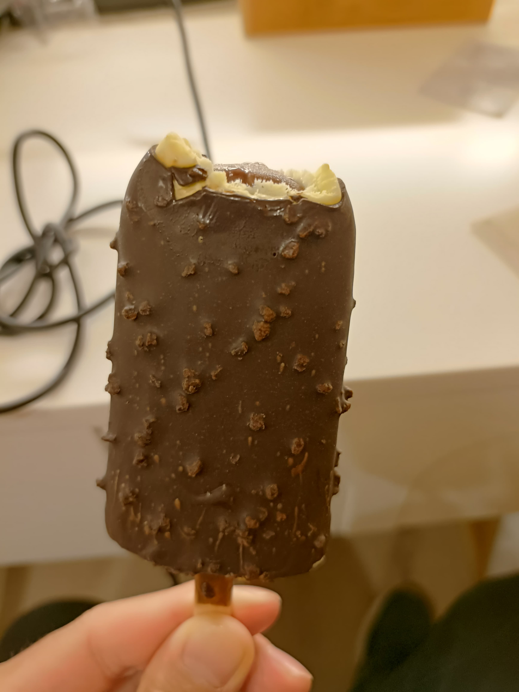

アイス: 3.7/5

## 二日目<a name="second-day">

### McDonalds (おかゆ・油条・朝ラップ)

上海に来てマクドナルドを食べてはちょっと損ですね。けど口癖は朝で豫園に回ってその後はお腹はペコペコでした。公園で観光客が多すぎてよく見ませんでした。そして観光客トラップな周辺食べ物は高かったためにマクドナルドをたべました。

この旅でおかゆと油条を食べては今回だけでした。けどマクドナルドとしては結構うまかった。と朝のラップは普通でした。以外と日本の侍マックのようにローカルの料理に合わせての食べ物はそんなに悪くなかったです。

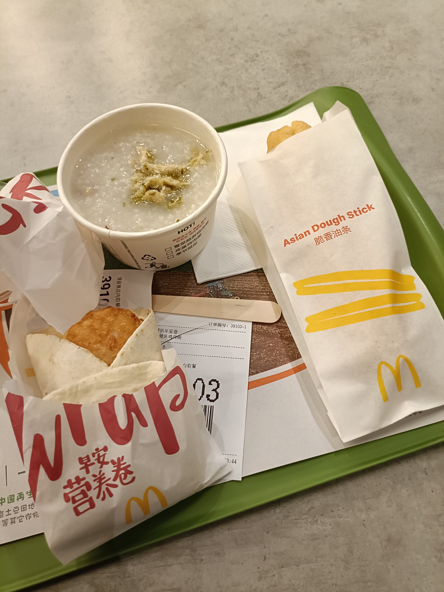

おかゆ: 3.3/5,
油条: 3.5/5,
朝ラップ: 3.2/5

### 火鍋・生煎包みたいなもの・茶葉蛋(チャーイエダン)

兄のおすすめで七宝鎮に行きました。その途中でショッピングモールがあって（上海でショッピングモールが多い）麺の店に入りました。メニューに見た際にあこれは美味しそうと頼みましたけど実はただの火鍋でした（麺に関係ない）。と茶卵と生煎包みたいな前菜を注文した。火鍋はもともと牛肉が入ってけど売り切れのために豚肉をもらいました。

火鍋は美味しかったです（けど店の名物ではなかった？）。と生煎包はまあまあと茶卵は美味しかったです

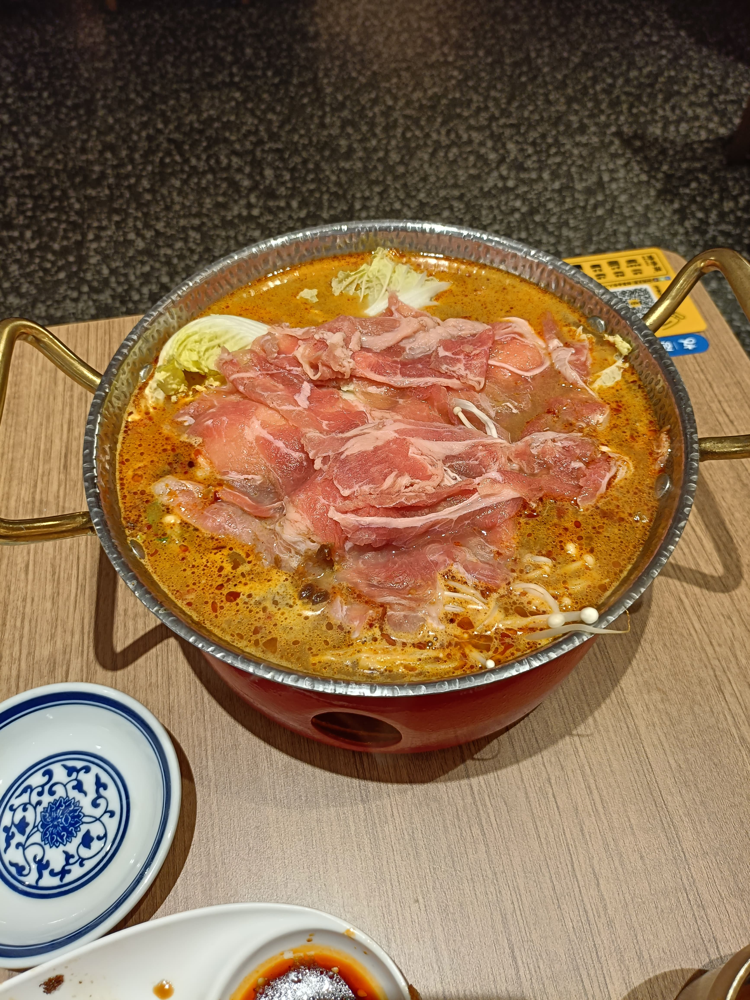

火鍋: 3.7/5,
生煎包みたいなもの: 3.3/5,
茶葉蛋: 3.5/5

### レモンティー - No Yeye No Tea

店の名前は面白いｗｗ。けど同じモールで色んな茶の店があってけど名前が面白かったためにここに注文しました。実は注文する際にデータは酷くて多分最初から10分ぐらいかかった後で注文はできました。茶はまあCHAGEEと比べてちょっとだけ低かったですが普通に美味しかったです（ライムの量が少なくて自分の好みはあった方がうまかった）。

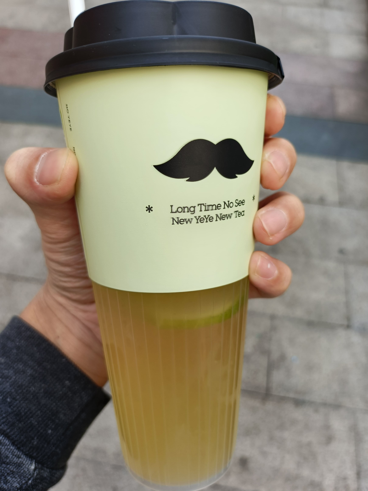

レモンティー(yeye): 3.5/5

### 七宝鎮のストリートフード・葱油饼（ツォンヨウビン）・油墩子(ヨウドゥンツ)・臭豆腐(しゅうどうふ)

七宝鎮は観光な場所とおもいませでした。普通歴史にとっていい場所と思ってけど行った際にお土産の店が多くてとストリートフードも売りました。二つの場所で食べ物を買いました。

まずは葱油饼と油墩子を売っている場所に行きました。葱油饼はネギの油パンケーキみたいなものと油墩子は上げ細長いジャガイモのマッシュみたいなものです。どっちも美味しかったけど自分の好みは葱油饼の方です。

そして臭豆腐も食べました。匂いはそんなに悪くなかった。味は自分の舌と合って美味しかったです。煮物でラーのソースをかけて漬物とネギなどに加えて豆腐は美味しかったです。と黒豆腐は初めて食べました（白いの方がうまかったけど）。

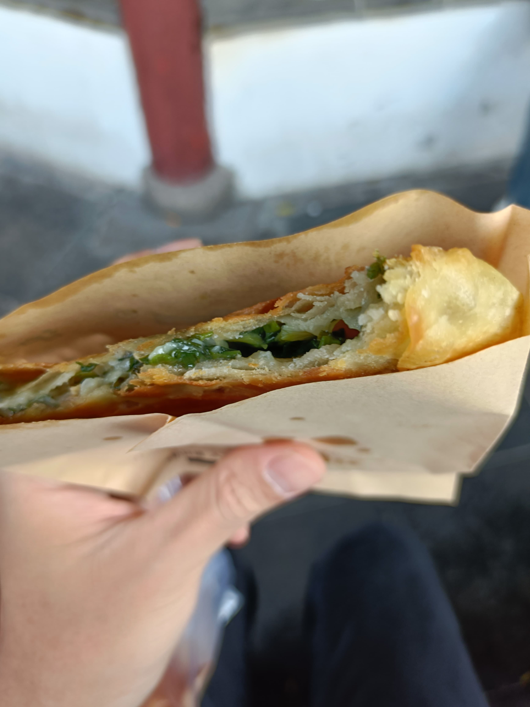
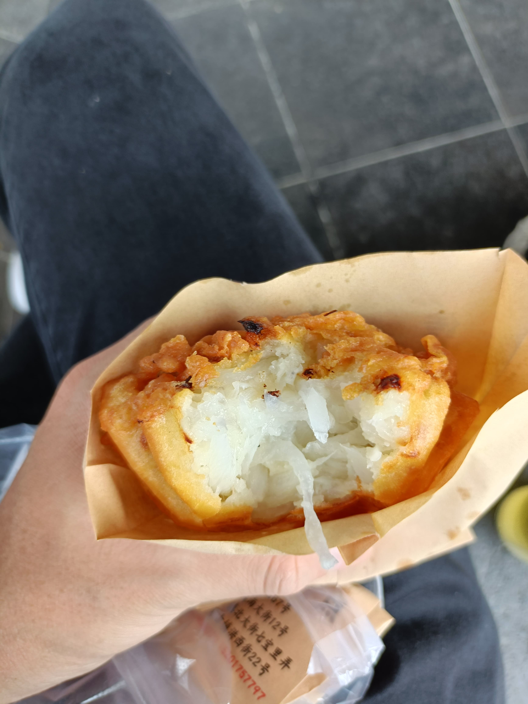
<a name="tofu">

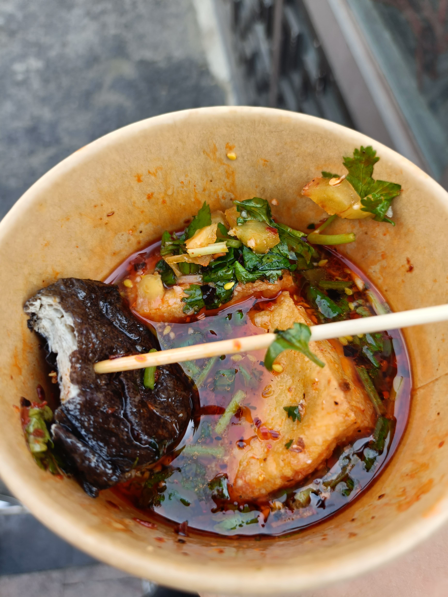

葱油饼: 3.75/5,
油墩子: 3.5/5,
臭豆腐: 4/5

### 酸辣粉(サンラーフン)・涼皮(リャンピー)

二日目で最後に食べたものはこの二つです。上海で辛い料理はあんまり流行っていないきがするですが朱家角鎮（これも兄のおすすめでいきました）の出口である店を見つかった安いと辛い料理も食べたいと思ってここを選びました。

この店で治安はユニークでした。例えば二人の女性はタクシーを待っている間に注文しましたけど記憶によっては注文は間に合いませんでした。その後は年寄りな方は訪問したこの料理ありますかと座って3分ぐらいを待てた後で店を出ました。料理は食べ終わる辺りで８人ぐらいがこの１６席・４テーブルの店に入って占領しました。上海で一名の際はテーブルを共有するは結構普通でしたので入って組が私のテーブルを乗っ取りました。食べ終わる際に来ては個人的によかったです。

料理はめっちゃ美味しかった。こういう辛いは欲しいでした。あんまりこうみたいな辛さは東京は見つかりづらい（麻辣湯を除いて）。リャンピーは以外にさわやかでした。酸辣粉の酢と辛さのコンビは超うまかったです。

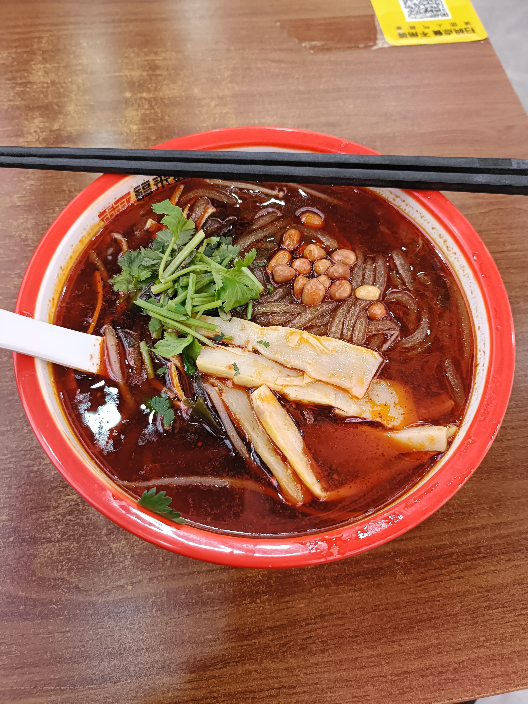
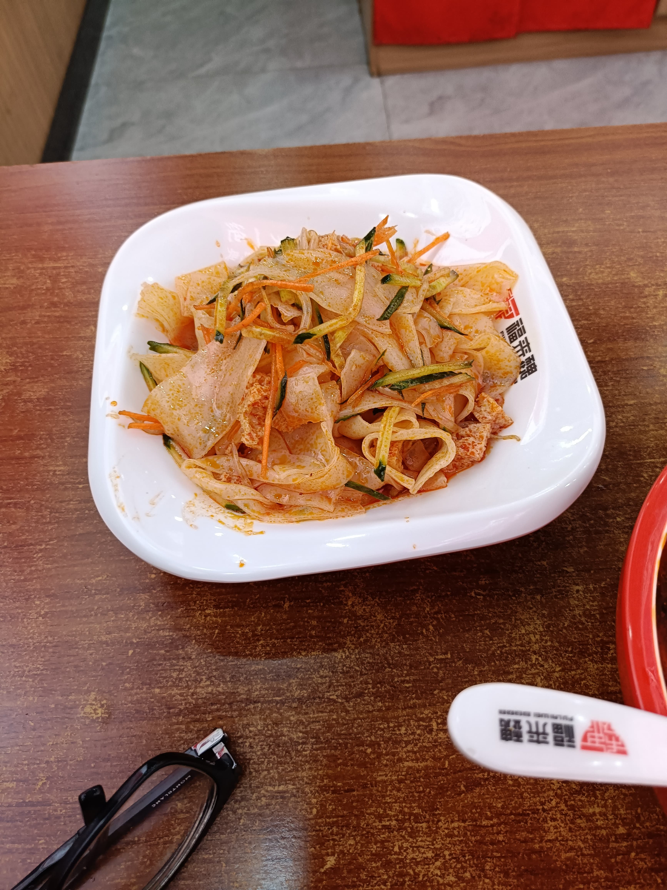

酸辣粉: 3.75/5,
涼皮: 3.6/5

## 三日目<a name="third-day">

### 抹茶ラッテ・Luckin Coffee(ラックインコーヒー)

三日目は最後の日でした。その日はまずは田子坊(tianzifang)に行きました。最寄り駅にluckin coffeeで鬼滅の刃のタイアップがあってそれを注文しました。私は抹茶に対して美味しいけど高い派ですがこれは結構うまかった。ちなみに鬼滅の刃は見たことがない。

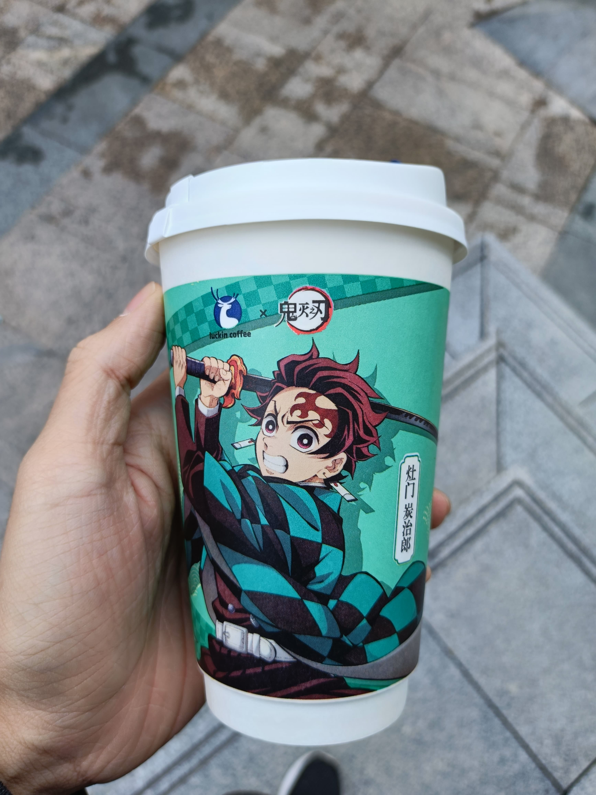

抹茶ラッテ: 3.5/5

### ジャンビン(また・肉あり)

田子坊の入り口辺りでストリートフードの店もいくつかがあって一日目に食べたジャンビンをもういちど食べたかった。今回は肉を頼ました。具は真中に集中したために外はちょっとパンケーキの味がすぎてけどそれを置いておいて美味でした。特に肉は美味しかったです。また食べたい。

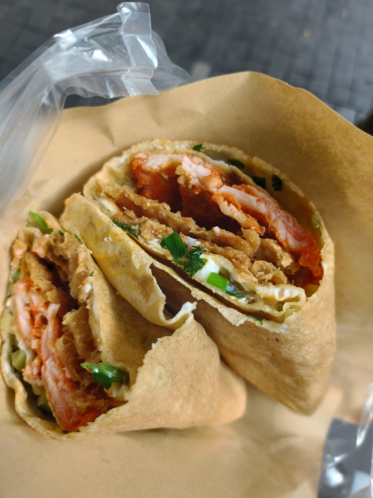

ジャンビン： 3.9/5

### カボチャ・塩たまごのタピオカティー

三日目で飲んだタピオカティーは独特でした。今回は[Shangcheng駅](https://maps.app.goo.gl/eyJriWGDN8CUfrd37)辺りのモールでティーを買いました。店の名前はA Little Tea。今回は季節に合わせた物を頼みました。普通の茶とカボチャ・塩卵（アヒルの漬物卵）を混ぜたペーストはカップの内周りに付けました。そして小さいなパールもあって（無料）。ペーストは主にカボチャの味けどちょっと塩かったです。三つの茶の中で一番独特けど結構おいしかったです。

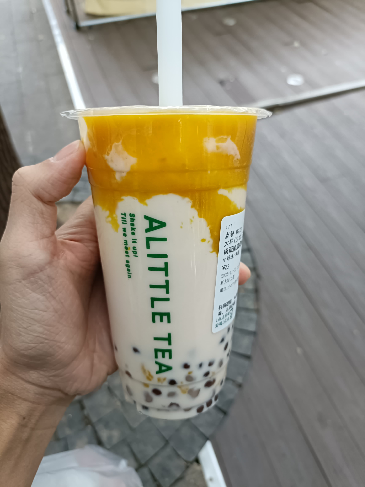

カボチャ塩卵茶： 3.8/5

### 腸麺・青椒肉絲（チンジャオロウスー）- 哈灵面馆

最後のミールはHarling?という店で食べました。人民広場の辺りの食堂みたいな場所でした。値段はリーゾナブルと量は結構ありました。中国に行ったからこそ豚か牛の内部を食べたかった。このみせは豚の腸をソースに混ぜて麺の上にメニューがあって注文しました。チンジャオロウスーと野菜も頼みました。理由はジャンビン以外には普通の食べ物は今日はあんまり食べませんでした。腹はペコペコでした。

全ては美味しかった。英語といえばHeartyな食べ物でした。味は強くて弱くてでもないただ美味しかったです。腸はもうちょっと臭があってほうが美味しいけど。

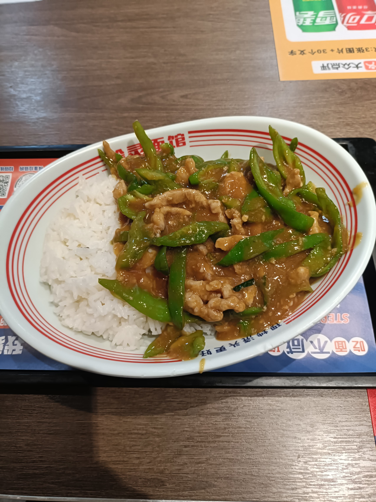
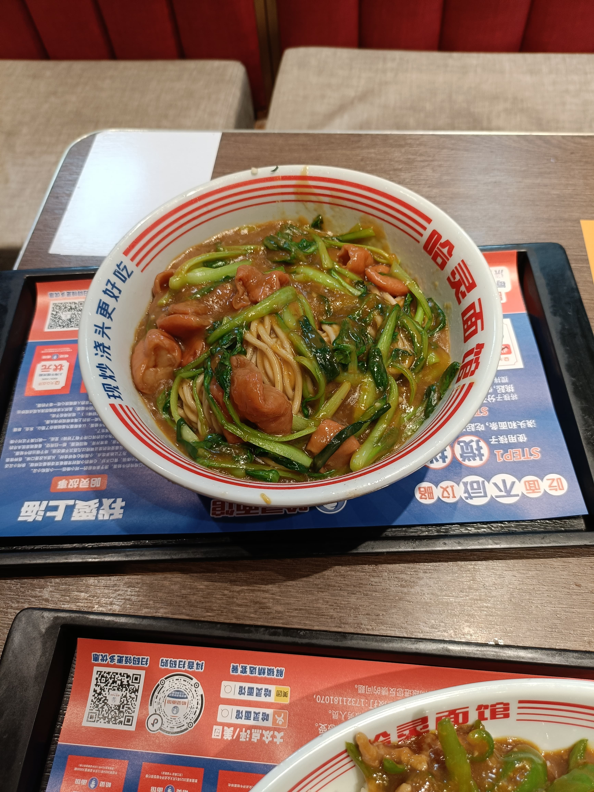

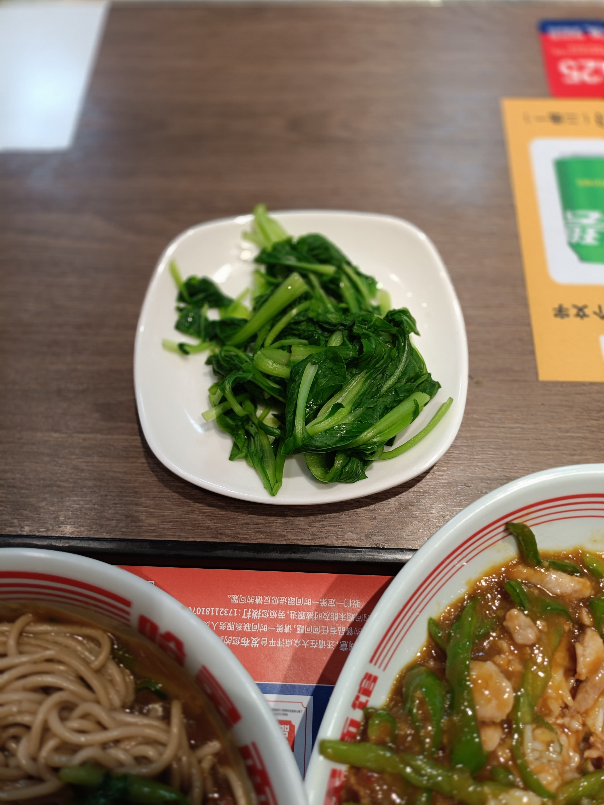

チンジャオロウスー： 3.5/5,
腸麺： 3.7/5,
野菜: 3.3/5

### 薬混ぜアイス：黒ゴマ湯円と生姜

最後に食べてものはアイスでした。前のごはんの後はアイスを食べたかったためにネットで上海アイスを検索して最後に回った場所は[忠曜堂](https://www.instagram.com/zhongyaotang_gelato/)という店でした。この店は薬とジェラートを混ぜてアイスを出します。色んな味があったけど私は中国風の黒ゴマと生姜味を選べました。

個人的にどっちも美味しかったです。黒ゴマは結構好きと湯円の皮もジェラートに混ぜました。ジンジャーは普通にすきなのでアイスの中でも美味しいです。

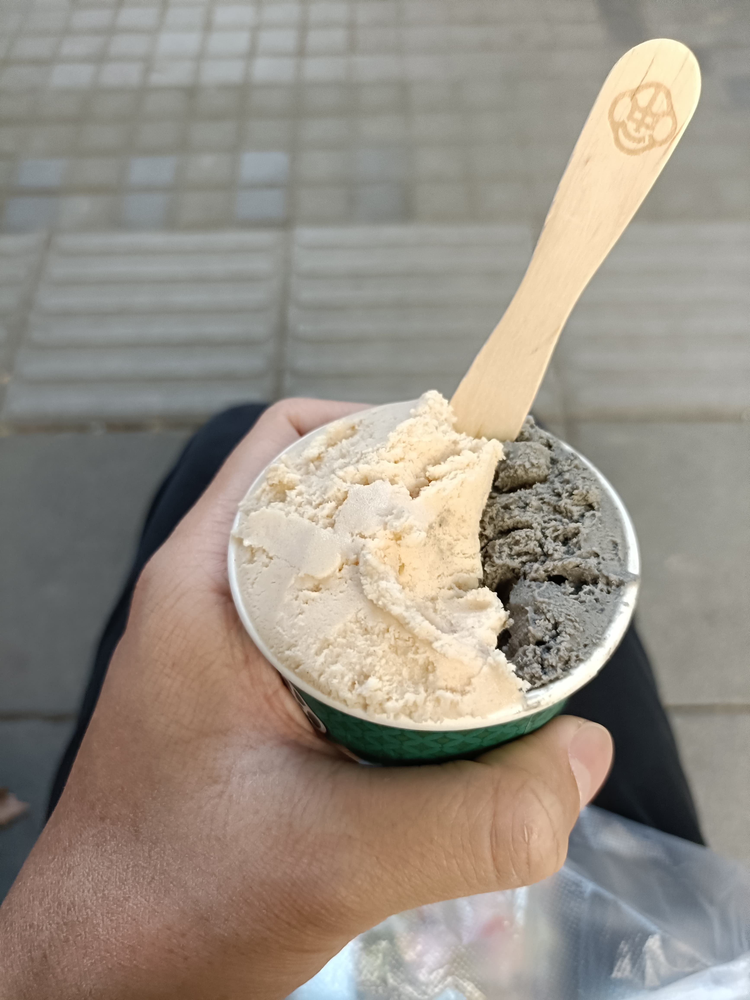

ジェラート：4/5

## 最後に<a name="finally">

上海は本当に楽しかった。東京と違ってどこに行ってもうおおおという感じがありました（特に南京路と色んなモールとか）。多分場所を比べてよりその新鮮さは欲しかったです。

けどこの記事は主に食べ物を共有するための記事です。なので最後に上のスコアを無視して三つベストはこちらです。

1. [ジャンビン（一日目の）](#jianbing)
2. [小籠包](#xlb)
3. [臭豆腐](#tofu)

今回の記事はここまでです！次回はもっと短い記事を書きたいです。多分誰も読みませんけど今回は日本語を書く練習と仕事以外に自分の考えを伝える練習みたいなものでした。これからもよろしくお願いします。